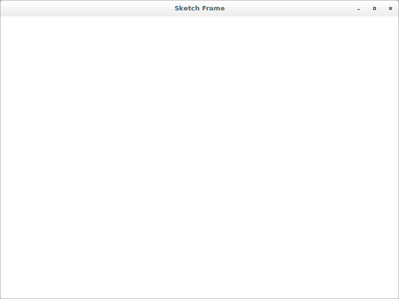

# Development

## Add a basic starting point for the initial version

The application's source code is:

```python
#!/usr/bin/env python3
import wx

class SketchFrame(wx.Frame):
    def __init__(self, parent):
        wx.Frame.__init__(self, 
                          parent, 
                          -1, 
                          "Sketch Frame", 
                          size = (800, 600))

class App(wx.App):
    def OnInit(self):
        self.frame = SketchFrame(None)
        self.frame.Show(True)
        self.SetTopWindow(self.frame)
        return True

def main():
    app = App(False)
    app.MainLoop()


if __name__ == '__main__':
    main()
```


Also, type `$ git checkout 1b` to perform a checkout of this version.

## Add the `SketchWindow` class and modify the `SketchFrame` class

The `SketchWindow` class is added with a minimal initialization 
definition and the `sketch` variable in the `SketchFrame` class is 
created.

The application's source code is:

```python
#!/usr/bin/env python3
import wx

class SketchWindow(wx.Window):
    def __init__(self, parent, id):
        wx.Window.__init__(self, parent, id)
        self.SetBackgroundColour("White")
        self.color = "Black"
        self.thickness = 1
        self.pen = wx.Pen(self.color, self.thickness, wx.SOLID)
        self.lines = []
        self.curLine = []
        self.pos = (0, 0)

class SketchFrame(wx.Frame):
    def __init__(self, parent):
        wx.Frame.__init__(self, 
                          parent, 
                          -1, 
                          "Sketch Frame", 
                          size = (800, 600))
        self.sketch = SketchWindow(self, -1)

class App(wx.App):
    def OnInit(self):
        self.frame = SketchFrame(None)
        self.frame.Show(True)
        self.SetTopWindow(self.frame)
        return True

def main():
    app = App(False)
    app.MainLoop()


if __name__ == '__main__':
    main()
```



Also, type `$ git checkout 1c` to perform a checkout of this version.

## Add the `InitBuffer()` and `DrawLines()` methods to `SketchWindow`

The `InitBuffer()` method is added to the `SketchWindow` initialization 
definition. Also, both `InitBuffer()` and `DrawLines()` methods are 
added to the `SketchWindow` class.

The application's source code is:

```python
#!/usr/bin/env python3
import wx

class SketchWindow(wx.Window):
    def __init__(self, parent, id):
        wx.Window.__init__(self, parent, id)
        self.SetBackgroundColour("White")
        self.color = "Black"
        self.thickness = 1
        self.pen = wx.Pen(self.color, self.thickness, wx.SOLID)
        self.lines = []
        self.curLine = []
        self.pos = (0, 0)
        self.InitBuffer()

    def InitBuffer(self):
        size = self.GetClientSize()
        self.buffer = wx.Bitmap(size.width, size.height)
        dc = wx.BufferedDC(None, self.buffer)
        dc.SetBackground(wx.Brush(self.GetBackgroundColour()))
        dc.Clear()
        self.DrawLines(dc)
        self.reInitBuffer = False

    def DrawLines(self, dc):
        for colour, thickness, line in self.lines:
            pen = wx.Pen(colour, thickness, wx.SOLID)
            dc.SetPen(pen)
            for coords in line:
                dc.DrawLine(*coords)

class SketchFrame(wx.Frame):
    def __init__(self, parent):
        wx.Frame.__init__(self, 
                          parent, 
                          -1, 
                          "Sketch Frame", 
                          size = (800, 600))
        self.sketch = SketchWindow(self, -1)

class App(wx.App):
    def OnInit(self):
        self.frame = SketchFrame(None)
        self.frame.Show(True)
        self.SetTopWindow(self.frame)
        return True

def main():
    app = App(False)
    app.MainLoop()


if __name__ == '__main__':
    main()
```

Also, type `$ git checkout 1d` to perform a checkout of this version.

## Bind `OnLeftDown` and `OnLeftUp` events to `SketchWindow` and add method definitions

The application's source code is:

```python
#!/usr/bin/env python3
import wx

class SketchWindow(wx.Window):
    def __init__(self, parent, id):
        wx.Window.__init__(self, parent, id)
        self.SetBackgroundColour("White")
        self.color = "Black"
        self.thickness = 1
        self.pen = wx.Pen(self.color, self.thickness, wx.SOLID)
        self.lines = []
        self.curLine = []
        self.pos = (0, 0)
        self.InitBuffer()

        self.Bind(wx.EVT_LEFT_DOWN, self.OnLeftDown)
        self.Bind(wx.EVT_LEFT_UP, self.OnLeftUp)

    def InitBuffer(self):
        size = self.GetClientSize()
        self.buffer = wx.Bitmap(size.width, size.height)
        dc = wx.BufferedDC(None, self.buffer)
        dc.SetBackground(wx.Brush(self.GetBackgroundColour()))
        dc.Clear()
        self.DrawLines(dc)
        self.reInitBuffer = False

    def DrawLines(self, dc):
        for colour, thickness, line in self.lines:
            pen = wx.Pen(colour, thickness, wx.SOLID)
            dc.SetPen(pen)
            for coords in line:
                dc.DrawLine(*coords)

    def OnLeftDown(self, event):
        self.curLine = []
        self.pos = event.GetPosition()
        self.CaptureMouse()

    def OnLeftUp(self, event):
        if self.HasCapture():
            self.lines.append((self.color, 
                               self.thickness, 
                               self.curLine))
            self.curLine = []
            self.ReleaseMouse()

class SketchFrame(wx.Frame):
    def __init__(self, parent):
        wx.Frame.__init__(self, 
                          parent, 
                          -1, 
                          "Sketch Frame", 
                          size = (800, 600))
        self.sketch = SketchWindow(self, -1)

class App(wx.App):
    def OnInit(self):
        self.frame = SketchFrame(None)
        self.frame.Show(True)
        self.SetTopWindow(self.frame)
        return True

def main():
    app = App(False)
    app.MainLoop()


if __name__ == '__main__':
    main()
```

Also, type `$ git checkout 1e` to perform a checkout of this version.

## Add a first functional application that draws black lines and resizes sketch

Bind `OnMotion`, `OnSize`, `OnIdle`, and `OnPaint` events 
to `SketchWindow` and add method definitions. Also, add `GetLinesData`
, `SetLinesData`, `drawMotion`, `SetColor` and `SetThickness` method 
definitions.

The application's source code is:

```python
#!/usr/bin/env python3
import wx

class SketchWindow(wx.Window):
    def __init__(self, parent, id):
        wx.Window.__init__(self, parent, id)
        self.SetBackgroundColour("White")
        self.color = "Black"
        self.thickness = 1
        self.pen = wx.Pen(self.color, self.thickness, wx.SOLID)
        self.lines = []
        self.curLine = []
        self.pos = (0, 0)
        self.InitBuffer()

        self.Bind(wx.EVT_LEFT_DOWN, self.OnLeftDown)
        self.Bind(wx.EVT_LEFT_UP, self.OnLeftUp)
        self.Bind(wx.EVT_MOTION, self.OnMotion)
        self.Bind(wx.EVT_SIZE, self.OnSize)
        self.Bind(wx.EVT_IDLE, self.OnIdle)
        self.Bind(wx.EVT_PAINT, self.OnPaint)

    def InitBuffer(self):
        size = self.GetClientSize()
        self.buffer = wx.Bitmap(size.width, size.height)
        dc = wx.BufferedDC(None, self.buffer)
        dc.SetBackground(wx.Brush(self.GetBackgroundColour()))
        dc.Clear()
        self.DrawLines(dc)
        self.reInitBuffer = False

    def GetLinesData(self):
        return self.lines[:]

    def SetLinesData(self, lines):
        self.lines = lines[:]
        self.InitBuffer()
        self.Refresh()

    def DrawLines(self, dc):
        for colour, thickness, line in self.lines:
            pen = wx.Pen(colour, thickness, wx.SOLID)
            dc.SetPen(pen)
            for coords in line:
                dc.DrawLine(*coords)

    def OnLeftDown(self, event):
        self.curLine = []
        self.pos = event.GetPosition()
        self.CaptureMouse()

    def OnLeftUp(self, event):
        if self.HasCapture():
            self.lines.append((self.color, 
                               self.thickness, 
                               self.curLine))
            self.curLine = []
            self.ReleaseMouse()

    def OnMotion(self, event):
        if event.Dragging() and event.LeftIsDown():
            dc = wx.BufferedDC(wx.ClientDC(self), self.buffer)
            self.drawMotion(dc, event)
        event.Skip()

    def drawMotion(self, dc, event):
        dc.SetPen(self.pen)
        newPos = event.GetPosition()
        coords = tuple(self.pos) + tuple(newPos)
        self.curLine.append(coords)
        dc.DrawLine(*coords)
        self.pos = newPos

    def OnSize(self, event):
        self.reInitBuffer = True

    def OnIdle(self, event):
        if self.reInitBuffer:
            self.InitBuffer()
            self.Refresh(False)

    def OnPaint(self, event):
        dc = wx.BufferedPaintDC(self, self.buffer)

    def SetColor(self, color):
        self.color = color
        self.pen = wx.Pen(self.color, self.thickness, wx.SOLID)

    def SetThickness(self, num):
        self.thickness = num
        self.pen = wx.Pen(self.color, self.thickness, wx.SOLID)

class SketchFrame(wx.Frame):
    def __init__(self, parent):
        wx.Frame.__init__(self, 
                          parent, 
                          -1, 
                          "Sketch Frame", 
                          size = (800, 600))
        self.sketch = SketchWindow(self, -1)

class App(wx.App):
    def OnInit(self):
        self.frame = SketchFrame(None)
        self.frame.Show(True)
        self.SetTopWindow(self.frame)
        return True

def main():
    app = App(False)
    app.MainLoop()


if __name__ == '__main__':
    main()
```


Also, type `$ git checkout 2a` to perform a checkout of this version.

## Rename main script so `SketchWindow` is importable

Rewrite main script so it's possible to import `SkecthWindow` class. 
To do that, just rename the old main script to `base.py` using Git:

`$ git mv sketchy.py base.py`

Also, type `$ git checkout 2b` to perform a checkout of this version.

## Use main script with the `base` module

The application's source code is:

```python
#!/usr/bin/env python3
import wx
from base import SketchWindow

class SketchFrame(wx.Frame):
    def __init__(self, parent):
        wx.Frame.__init__(self, 
                          parent, 
                          -1, 
                          "Sketch Frame", 
                          size = (800, 600))
        self.sketch = SketchWindow(self, -1)

class App(wx.App):
    def OnInit(self):
        self.frame = SketchFrame(None)
        self.frame.Show(True)
        self.SetTopWindow(self.frame)
        return True

def main():
    app = App(False)
    app.MainLoop()


if __name__ == '__main__':
    main()
```

Also, type `$ git checkout 2c` to perform a checkout of this version.

## Add, place and update status bar in the bottom of a frame

* Bind the `OnSketchMotion` event handler to the `wx.EVT_MOTION` event 
within the `SkectchFrame` class.
* Create the status bar within the `SkectchFrame` class.
* Add the `OnSketchMotion` method definition to display the current 
mouse pointer position in the status bar.

The application's source code is:

```python
#!/usr/bin/env python3
import wx
from base import SketchWindow

class SketchFrame(wx.Frame):
    def __init__(self, parent):
        wx.Frame.__init__(self, 
                          parent, 
                          -1, 
                          "Sketch Frame", 
                          size = (800, 600))
        self.sketch = SketchWindow(self, -1)
        self.sketch.Bind(wx.EVT_MOTION, self.OnSketchMotion)
        self.statusbar = self.CreateStatusBar()

    def OnSketchMotion(self, event):
        self.statusbar.SetStatusText(str(event.GetPosition()))
        event.Skip()

class App(wx.App):
    def OnInit(self):
        self.frame = SketchFrame(None)
        self.frame.Show(True)
        self.SetTopWindow(self.frame)
        return True

def main():
    app = App(False)
    app.MainLoop()


if __name__ == '__main__':
    main()
```


Also, type `$ git checkout 3a` to perform a checkout of this version.

## Configure status bar to display three text fields

* Create three status text fields in the status bar by calling the 
method `SetFieldsCount(3)`.
* Adjust the sizes of the text fields in the status bar by calling the 
method `SetStatusWidths([-1, -2, -3])`.
* Add support for two more status fields, one which shows the number of 
points in the current line being drawn, the other shows the number of 
lines in the current sketch.

The application's source code is:

```python
#!/usr/bin/env python3
import wx
from base import SketchWindow

class SketchFrame(wx.Frame):
    def __init__(self, parent):
        wx.Frame.__init__(self, 
                          parent, 
                          -1, 
                          "Sketch Frame", 
                          size = (800, 600))
        self.sketch = SketchWindow(self, -1)
        self.sketch.Bind(wx.EVT_MOTION, self.OnSketchMotion)
        self.statusbar = self.CreateStatusBar()
        self.statusbar.SetFieldsCount(3)
        self.statusbar.SetStatusWidths([-1, -2, -3])

    def OnSketchMotion(self, event):
        self.statusbar.SetStatusText("Pos: {}".\
                                     format(str(event.GetPosition())), 
                                     0)
        self.statusbar.SetStatusText("Current Pts: {}".\
                                     format(len(self.sketch.curLine)), 
                                     1)
        self.statusbar.SetStatusText("Line Count: {}".\
                                     format(len(self.sketch.lines)), 
                                     2)
        event.Skip()

class App(wx.App):
    def OnInit(self):
        self.frame = SketchFrame(None)
        self.frame.Show(True)
        self.SetTopWindow(self.frame)
        return True

def main():
    app = App(False)
    app.MainLoop()


if __name__ == '__main__':
    main()
```


Also, type `$ git checkout 3b` to perform a checkout of this version.

## Include a submenu and checked or radio menu item

* Rewrite the way the status bar is created in the `SkectchFrame` 
class by using the `initStatusBar` method (remember refactoring).
* Create the menu bar by calling the method `createMenuBar` and add 
these methods and/or functions: `menuData`, `createMenuBar`
, `createMenu` and `createMenuItem`.
* Add and define event handlers `OnNew`, `OnOpen`, `OnSave`, `OnColor` 
and `OnCloseWindow`.

The application's source code is:

```python
#!/usr/bin/env python3
import wx
from base import SketchWindow

class SketchFrame(wx.Frame):
    def __init__(self, parent):
        wx.Frame.__init__(self, 
                          parent, 
                          -1, 
                          "Sketch Frame", 
                          size = (800, 600))
        self.sketch = SketchWindow(self, -1)
        self.sketch.Bind(wx.EVT_MOTION, self.OnSketchMotion)
        self.initStatusBar()
        self.createMenuBar()

    def initStatusBar(self):
        self.statusbar = self.CreateStatusBar()
        self.statusbar.SetFieldsCount(3)
        self.statusbar.SetStatusWidths([-1, -2, -3])

    def OnSketchMotion(self, event):
        self.statusbar.SetStatusText("Pos: {}".\
                                     format(str(event.GetPosition())), 
                                     0)
        self.statusbar.SetStatusText("Current Pts: {}".\
                                     format(len(self.sketch.curLine)), 
                                     1)
        self.statusbar.SetStatusText("Line Count: {}".\
                                     format(len(self.sketch.lines)), 
                                     2)
        event.Skip()

    def menuData(self):
        return [("&File", (
                          ("&New", "New Sketch file", self.OnNew), 
                          ("&Open", "Open sketch file", self.OnOpen), 
                          ("&Save", "Save sketch file", self.OnSave), 
                          ("", "", ""), 
                          ("&Color", (
                                     ("&Black", 
                                      "", 
                                      self.OnColor, 
                                      wx.ITEM_RADIO), 
                                     ("&Red", 
                                      "", 
                                      self.OnColor, 
                                      wx.ITEM_RADIO), 
                                     ("&Green", 
                                      "", 
                                      self.OnColor, 
                                      wx.ITEM_RADIO), 
                                     ("&Blue", 
                                      "", 
                                      self.OnColor, 
                                      wx.ITEM_RADIO))), 
                          ("", "", ""),
                          ("&Quit", "Quit", self.OnCloseWindow)))]

    def createMenuBar(self):
        menuBar = wx.MenuBar()
        for eachMenuData in self.menuData():
            menuLabel = eachMenuData[0]
            menuItems = eachMenuData[1]
            menuBar.Append(self.createMenu(menuItems), menuLabel)
        self.SetMenuBar(menuBar)

    def createMenu(self, menuData):
        menu = wx.Menu()
        for eachItem in menuData:
            if len(eachItem) == 2:
                label = eachItem[0]
                subMenu = self.createMenu(eachItem[1])
                menu.Append(wx.NewId(), label, subMenu)
            else:
                self.createMenuItem(menu, *eachItem)
        return menu

    def createMenuItem(self, 
                       menu, 
                       label, 
                       status, 
                       handler, 
                       kind = wx.ITEM_NORMAL):
        if not label:
            menu.AppendSeparator()
            return
        menuItem = menu.Append(-1, label, status, kind)
        self.Bind(wx.EVT_MENU, handler, menuItem)

    def OnNew(self, event): pass
    def OnOpen(self, event): pass
    def OnSave(self, event): pass

    def OnColor(self, event):
        menubar = self.GetMenuBar()
        itemId = event.GetId()
        item = menubar.FindItemById(itemId)
        color = item.GetLabel()
        self.sketch.SetColor(color)

    def OnCloseWindow(self, event):
        self.Destroy()

class App(wx.App):
    def OnInit(self):
        self.frame = SketchFrame(None)
        self.frame.Show(True)
        self.SetTopWindow(self.frame)
        return True

def main():
    app = App(False)
    app.MainLoop()


if __name__ == '__main__':
    main()
```


Also, type `$ git checkout 3c` to perform a checkout of this version.

## Include a toolbar

* Create the toolbar by calling the method `createToolBar` and add 
these methods and/or functions: `createToolBar`, `createTool`
, `toolbarData`, `createColorTool`, `MakeBitmap` and `toolbarColorData`.
* Change the `OnColor` method to reflect changes to the toolbar 
selection.
* Make sure toolbar icon files within *files* folder are available.

The application's source code is:

```python
#!/usr/bin/env python3
import wx
from base import SketchWindow

class SketchFrame(wx.Frame):
    def __init__(self, parent):
        wx.Frame.__init__(self, 
                          parent, 
                          -1, 
                          "Sketch Frame", 
                          size = (800, 600))
        self.sketch = SketchWindow(self, -1)
        self.sketch.Bind(wx.EVT_MOTION, self.OnSketchMotion)
        self.initStatusBar()
        self.createMenuBar()
        self.createToolBar()

    def initStatusBar(self):
        self.statusbar = self.CreateStatusBar()
        self.statusbar.SetFieldsCount(3)
        self.statusbar.SetStatusWidths([-1, -2, -3])

    def OnSketchMotion(self, event):
        self.statusbar.SetStatusText("Pos: {}".\
                                     format(str(event.GetPosition())), 
                                     0)
        self.statusbar.SetStatusText("Current Pts: {}".\
                                     format(len(self.sketch.curLine)), 
                                     1)
        self.statusbar.SetStatusText("Line Count: {}".\
                                     format(len(self.sketch.lines)), 
                                     2)
        event.Skip()

    def menuData(self):
        return [("&File", (
                          ("&New", "New Sketch file", self.OnNew), 
                          ("&Open", "Open sketch file", self.OnOpen), 
                          ("&Save", "Save sketch file", self.OnSave), 
                          ("", "", ""), 
                          ("&Color", (
                                     ("&Black", 
                                      "", 
                                      self.OnColor, 
                                      wx.ITEM_RADIO), 
                                     ("&Red", 
                                      "", 
                                      self.OnColor, 
                                      wx.ITEM_RADIO), 
                                     ("&Green", 
                                      "", 
                                      self.OnColor, 
                                      wx.ITEM_RADIO), 
                                     ("&Blue", 
                                      "", 
                                      self.OnColor, 
                                      wx.ITEM_RADIO))), 
                          ("", "", ""),
                          ("&Quit", "Quit", self.OnCloseWindow)))]

    def createMenuBar(self):
        menuBar = wx.MenuBar()
        for eachMenuData in self.menuData():
            menuLabel = eachMenuData[0]
            menuItems = eachMenuData[1]
            menuBar.Append(self.createMenu(menuItems), menuLabel)
        self.SetMenuBar(menuBar)

    def createMenu(self, menuData):
        menu = wx.Menu()
        for eachItem in menuData:
            if len(eachItem) == 2:
                label = eachItem[0]
                subMenu = self.createMenu(eachItem[1])
                menu.Append(wx.NewId(), label, subMenu)
            else:
                self.createMenuItem(menu, *eachItem)
        return menu

    def createMenuItem(self, 
                       menu, 
                       label, 
                       status, 
                       handler, 
                       kind = wx.ITEM_NORMAL):
        if not label:
            menu.AppendSeparator()
            return
        menuItem = menu.Append(-1, label, status, kind)
        self.Bind(wx.EVT_MENU, handler, menuItem)

    def createToolBar(self):
        toolbar = self.CreateToolBar()
        for each in self.toolbarData():
            self.createTool(toolbar, *each)
        toolbar.AddSeparator()
        for each in self.toolbarColorData():
            self.createColorTool(toolbar, each)
        toolbar.Realize()

    def createTool(self, toolbar, label, filename, help, handler):
        if not label:
            toolbar.AddSeparator()
            return
        bitmap = wx.Image(filename, wx.BITMAP_TYPE_BMP).ConvertToBitmap()
        tool = toolbar.AddTool(-1, 
                               label, 
                               bitmap, 
                               wx.NullBitmap, 
                               kind = wx.ITEM_NORMAL, 
                               shortHelpString = help, 
                               longHelpString = "", 
                               clientData = None)
        self.Bind(wx.EVT_MENU, handler, tool)

    def toolbarData(self):
        return (("New", 
                 "files/new.bmp", 
                 "Create new sketch", 
                 self.OnNew),
                ("", "", "", ""), 
                ("Open", 
                 "files/open.bmp", 
                 "Open existing sketch", 
                 self.OnOpen),
                ("Save", 
                 "files/save.bmp", 
                 "Save existing sketch", 
                 self.OnSave))

    def createColorTool(self, toolbar, color):
        bmp = self.MakeBitmap(color)
        tool = toolbar.AddRadioTool(-1, 
                                    label = "", 
                                    bitmap1 = bmp, 
                                    bmpDisabled = wx.NullBitmap, 
                                    shortHelp = color, 
                                    longHelp = "", 
                                    clientData = None)
        self.Bind(wx.EVT_MENU, self.OnColor, tool)

    def MakeBitmap(self, color):
        bmp = wx.Bitmap(16, 15)
        dc = wx.MemoryDC()
        dc.SelectObject(bmp)
        dc.SetBackground(wx.Brush(color))
        dc.Clear()
        dc.SelectObject(wx.NullBitmap)
        return bmp

    def toolbarColorData(self):
        return ("Black", "Red", "Green", "Blue")

    def OnNew(self, event): pass
    def OnOpen(self, event): pass
    def OnSave(self, event): pass

    def OnColor(self, event):
        menubar = self.GetMenuBar()
        itemId = event.GetId()
        item = menubar.FindItemById(itemId)
        if not item:
            toolbar = self.GetToolBar()
            item = toolbar.FindById(itemId)
            color = item.GetShortHelp()
        else:
            color = item.GetLabel()
        self.sketch.SetColor(color)

    def OnCloseWindow(self, event):
        self.Destroy()

class App(wx.App):
    def OnInit(self):
        self.frame = SketchFrame(None)
        self.frame.Show(True)
        self.SetTopWindow(self.frame)
        return True

def main():
    app = App(False)
    app.MainLoop()


if __name__ == '__main__':
    main()
```


Also, type `$ git checkout 3d` to perform a checkout of this version.

## Get standard information from the user (save file dialog)

* Import `pickle` and `os` modules.
* Add `wildcard` class variable to `SketchFrame`.
* Add `title` attribute to `SketchFrame` and rewrite its initialization.
* Add `filename` attribute to `SkectchFrame`.
* Define `OnSave` event handler.
* Add and define methods `OnSaveAs` and `SaveFile`.

The application's source code is:

```python
#!/usr/bin/env python3
import wx
import pickle, os
from base import SketchWindow

class SketchFrame(wx.Frame):
    wildcard = "Sketch files (*.sketch)|*.sketch|All files (*.*)|*.*"
    
    def __init__(self, parent):
        self.title = "Sketch Frame"
        wx.Frame.__init__(self, 
                          parent, 
                          -1, 
                          self.title, 
                          size = (800, 600))
        self.filename = ""
        self.sketch = SketchWindow(self, -1)
        self.sketch.Bind(wx.EVT_MOTION, self.OnSketchMotion)
        self.initStatusBar()
        self.createMenuBar()
        self.createToolBar()

    def initStatusBar(self):
        self.statusbar = self.CreateStatusBar()
        self.statusbar.SetFieldsCount(3)
        self.statusbar.SetStatusWidths([-1, -2, -3])

    def OnSketchMotion(self, event):
        self.statusbar.SetStatusText("Pos: {}".\
                                     format(str(event.GetPosition())), 
                                     0)
        self.statusbar.SetStatusText("Current Pts: {}".\
                                     format(len(self.sketch.curLine)), 
                                     1)
        self.statusbar.SetStatusText("Line Count: {}".\
                                     format(len(self.sketch.lines)), 
                                     2)
        event.Skip()

    def menuData(self):
        return [("&File", (
                          ("&New", "New Sketch file", self.OnNew), 
                          ("&Open", "Open sketch file", self.OnOpen), 
                          ("&Save", "Save sketch file", self.OnSave), 
                          ("", "", ""), 
                          ("&Color", (
                                     ("&Black", 
                                      "", 
                                      self.OnColor, 
                                      wx.ITEM_RADIO), 
                                     ("&Red", 
                                      "", 
                                      self.OnColor, 
                                      wx.ITEM_RADIO), 
                                     ("&Green", 
                                      "", 
                                      self.OnColor, 
                                      wx.ITEM_RADIO), 
                                     ("&Blue", 
                                      "", 
                                      self.OnColor, 
                                      wx.ITEM_RADIO))), 
                          ("", "", ""),
                          ("&Quit", "Quit", self.OnCloseWindow)))]

    def createMenuBar(self):
        menuBar = wx.MenuBar()
        for eachMenuData in self.menuData():
            menuLabel = eachMenuData[0]
            menuItems = eachMenuData[1]
            menuBar.Append(self.createMenu(menuItems), menuLabel)
        self.SetMenuBar(menuBar)

    def createMenu(self, menuData):
        menu = wx.Menu()
        for eachItem in menuData:
            if len(eachItem) == 2:
                label = eachItem[0]
                subMenu = self.createMenu(eachItem[1])
                menu.Append(wx.NewId(), label, subMenu)
            else:
                self.createMenuItem(menu, *eachItem)
        return menu

    def createMenuItem(self, 
                       menu, 
                       label, 
                       status, 
                       handler, 
                       kind = wx.ITEM_NORMAL):
        if not label:
            menu.AppendSeparator()
            return
        menuItem = menu.Append(-1, label, status, kind)
        self.Bind(wx.EVT_MENU, handler, menuItem)

    def createToolBar(self):
        toolbar = self.CreateToolBar()
        for each in self.toolbarData():
            self.createTool(toolbar, *each)
        toolbar.AddSeparator()
        for each in self.toolbarColorData():
            self.createColorTool(toolbar, each)
        toolbar.Realize()

    def createTool(self, toolbar, label, filename, help, handler):
        if not label:
            toolbar.AddSeparator()
            return
        bitmap = wx.Image(filename, wx.BITMAP_TYPE_BMP).ConvertToBitmap()
        tool = toolbar.AddTool(-1, 
                               label, 
                               bitmap, 
                               wx.NullBitmap, 
                               kind = wx.ITEM_NORMAL, 
                               shortHelpString = help, 
                               longHelpString = "", 
                               clientData = None)
        self.Bind(wx.EVT_MENU, handler, tool)

    def toolbarData(self):
        return (("New", 
                 "files/new.bmp", 
                 "Create new sketch", 
                 self.OnNew),
                ("", "", "", ""), 
                ("Open", 
                 "files/open.bmp", 
                 "Open existing sketch", 
                 self.OnOpen),
                ("Save", 
                 "files/save.bmp", 
                 "Save existing sketch", 
                 self.OnSave))

    def createColorTool(self, toolbar, color):
        bmp = self.MakeBitmap(color)
        tool = toolbar.AddRadioTool(-1, 
                                    label = "", 
                                    bitmap1 = bmp, 
                                    bmpDisabled = wx.NullBitmap, 
                                    shortHelp = color, 
                                    longHelp = "", 
                                    clientData = None)
        self.Bind(wx.EVT_MENU, self.OnColor, tool)

    def MakeBitmap(self, color):
        bmp = wx.Bitmap(16, 15)
        dc = wx.MemoryDC()
        dc.SelectObject(bmp)
        dc.SetBackground(wx.Brush(color))
        dc.Clear()
        dc.SelectObject(wx.NullBitmap)
        return bmp

    def toolbarColorData(self):
        return ("Black", "Red", "Green", "Blue")

    def OnNew(self, event): pass
    def OnOpen(self, event): pass

    def OnColor(self, event):
        menubar = self.GetMenuBar()
        itemId = event.GetId()
        item = menubar.FindItemById(itemId)
        if not item:
            toolbar = self.GetToolBar()
            item = toolbar.FindById(itemId)
            color = item.GetShortHelp()
        else:
            color = item.GetLabel()
        self.sketch.SetColor(color)

    def OnCloseWindow(self, event):
        self.Destroy()

    def OnSave(self, event):
        if not self.filename:
            self.OnSaveAs(event)
        else:
            self.SaveFile()

    def OnSaveAs(self, event):
        dlg = wx.FileDialog(self, 
                            "Save sketch as...", 
                            os.getcwd(), 
                            style = wx.FD_SAVE | wx.FD_OVERWRITE_PROMPT, 
                            wildcard = self.wildcard)
        if dlg.ShowModal() == wx.ID_OK:
            filename = dlg.GetPath()
            if not os.path.splitext(filename)[1]:
                filename = filename + '.sketch'
            self.filename = filename
            self.SaveFile()
            self.SetTitle(self.title + ' -- ' + self.filename)
        dlg.Destroy()

    def SaveFile(self):
        if self.filename:
            data = self.sketch.GetLinesData()
            f = open(self.filename, 'wb')
            pickle.dump(data, f)
            f.close()

class App(wx.App):
    def OnInit(self):
        self.frame = SketchFrame(None)
        self.frame.Show(True)
        self.SetTopWindow(self.frame)
        return True

def main():
    app = App(False)
    app.MainLoop()


if __name__ == '__main__':
    main()
```


Also, type `$ git checkout 4a` to perform a checkout of this version.

## Get standard information from the user (open file dialog)

* Define `OnOpen` event handler.
* Add and define method `ReadFile`.

The application's source code is:

```python
#!/usr/bin/env python3
import wx
import pickle, os
from base import SketchWindow

class SketchFrame(wx.Frame):
    wildcard = "Sketch files (*.sketch)|*.sketch|All files (*.*)|*.*"
    
    def __init__(self, parent):
        self.title = "Sketch Frame"
        wx.Frame.__init__(self, 
                          parent, 
                          -1, 
                          self.title, 
                          size = (800, 600))
        self.filename = ""
        self.sketch = SketchWindow(self, -1)
        self.sketch.Bind(wx.EVT_MOTION, self.OnSketchMotion)
        self.initStatusBar()
        self.createMenuBar()
        self.createToolBar()

    def initStatusBar(self):
        self.statusbar = self.CreateStatusBar()
        self.statusbar.SetFieldsCount(3)
        self.statusbar.SetStatusWidths([-1, -2, -3])

    def OnSketchMotion(self, event):
        self.statusbar.SetStatusText("Pos: {}".\
                                     format(str(event.GetPosition())), 
                                     0)
        self.statusbar.SetStatusText("Current Pts: {}".\
                                     format(len(self.sketch.curLine)), 
                                     1)
        self.statusbar.SetStatusText("Line Count: {}".\
                                     format(len(self.sketch.lines)), 
                                     2)
        event.Skip()

    def menuData(self):
        return [("&File", (
                          ("&New", "New Sketch file", self.OnNew), 
                          ("&Open", "Open sketch file", self.OnOpen), 
                          ("&Save", "Save sketch file", self.OnSave), 
                          ("", "", ""), 
                          ("&Color", (
                                     ("&Black", 
                                      "", 
                                      self.OnColor, 
                                      wx.ITEM_RADIO), 
                                     ("&Red", 
                                      "", 
                                      self.OnColor, 
                                      wx.ITEM_RADIO), 
                                     ("&Green", 
                                      "", 
                                      self.OnColor, 
                                      wx.ITEM_RADIO), 
                                     ("&Blue", 
                                      "", 
                                      self.OnColor, 
                                      wx.ITEM_RADIO))), 
                          ("", "", ""),
                          ("&Quit", "Quit", self.OnCloseWindow)))]

    def createMenuBar(self):
        menuBar = wx.MenuBar()
        for eachMenuData in self.menuData():
            menuLabel = eachMenuData[0]
            menuItems = eachMenuData[1]
            menuBar.Append(self.createMenu(menuItems), menuLabel)
        self.SetMenuBar(menuBar)

    def createMenu(self, menuData):
        menu = wx.Menu()
        for eachItem in menuData:
            if len(eachItem) == 2:
                label = eachItem[0]
                subMenu = self.createMenu(eachItem[1])
                menu.Append(wx.NewId(), label, subMenu)
            else:
                self.createMenuItem(menu, *eachItem)
        return menu

    def createMenuItem(self, 
                       menu, 
                       label, 
                       status, 
                       handler, 
                       kind = wx.ITEM_NORMAL):
        if not label:
            menu.AppendSeparator()
            return
        menuItem = menu.Append(-1, label, status, kind)
        self.Bind(wx.EVT_MENU, handler, menuItem)

    def createToolBar(self):
        toolbar = self.CreateToolBar()
        for each in self.toolbarData():
            self.createTool(toolbar, *each)
        toolbar.AddSeparator()
        for each in self.toolbarColorData():
            self.createColorTool(toolbar, each)
        toolbar.Realize()

    def createTool(self, toolbar, label, filename, help, handler):
        if not label:
            toolbar.AddSeparator()
            return
        bitmap = wx.Image(filename, wx.BITMAP_TYPE_BMP).ConvertToBitmap()
        tool = toolbar.AddTool(-1, 
                               label, 
                               bitmap, 
                               wx.NullBitmap, 
                               kind = wx.ITEM_NORMAL, 
                               shortHelpString = help, 
                               longHelpString = "", 
                               clientData = None)
        self.Bind(wx.EVT_MENU, handler, tool)

    def toolbarData(self):
        return (("New", 
                 "files/new.bmp", 
                 "Create new sketch", 
                 self.OnNew),
                ("", "", "", ""), 
                ("Open", 
                 "files/open.bmp", 
                 "Open existing sketch", 
                 self.OnOpen),
                ("Save", 
                 "files/save.bmp", 
                 "Save existing sketch", 
                 self.OnSave))

    def createColorTool(self, toolbar, color):
        bmp = self.MakeBitmap(color)
        tool = toolbar.AddRadioTool(-1, 
                                    label = "", 
                                    bitmap1 = bmp, 
                                    bmpDisabled = wx.NullBitmap, 
                                    shortHelp = color, 
                                    longHelp = "", 
                                    clientData = None)
        self.Bind(wx.EVT_MENU, self.OnColor, tool)

    def MakeBitmap(self, color):
        bmp = wx.Bitmap(16, 15)
        dc = wx.MemoryDC()
        dc.SelectObject(bmp)
        dc.SetBackground(wx.Brush(color))
        dc.Clear()
        dc.SelectObject(wx.NullBitmap)
        return bmp

    def toolbarColorData(self):
        return ("Black", "Red", "Green", "Blue")

    def OnNew(self, event): pass
    def OnOpen(self, event): pass

    def OnColor(self, event):
        menubar = self.GetMenuBar()
        itemId = event.GetId()
        item = menubar.FindItemById(itemId)
        if not item:
            toolbar = self.GetToolBar()
            item = toolbar.FindById(itemId)
            color = item.GetShortHelp()
        else:
            color = item.GetLabel()
        self.sketch.SetColor(color)

    def OnCloseWindow(self, event):
        self.Destroy()

    def OnSave(self, event):
        if not self.filename:
            self.OnSaveAs(event)
        else:
            self.SaveFile()

    def OnSaveAs(self, event):
        dlg = wx.FileDialog(self, 
                            "Save sketch as...", 
                            os.getcwd(), 
                            style = wx.FD_SAVE | wx.FD_OVERWRITE_PROMPT, 
                            wildcard = self.wildcard)
        if dlg.ShowModal() == wx.ID_OK:
            filename = dlg.GetPath()
            if not os.path.splitext(filename)[1]:
                filename = filename + '.sketch'
            self.filename = filename
            self.SaveFile()
            self.SetTitle(self.title + ' -- ' + self.filename)
        dlg.Destroy()

    def SaveFile(self):
        if self.filename:
            data = self.sketch.GetLinesData()
            f = open(self.filename, 'wb')
            pickle.dump(data, f)
            f.close()

    def OnOpen(self, event):
        dlg = wx.FileDialog(self, 
                            "Open sketch file...", 
                            os.getcwd(), 
                            style = wx.FD_OPEN, 
                            wildcard = self.wildcard)
        if dlg.ShowModal() == wx.ID_OK:
            self.filename = dlg.GetPath()
            self.ReadFile()
            self.SetTitle(self.title + ' -- ' + self.filename)
        dlg.Destroy()

    def ReadFile(self):
        if self.filename:
            try:
                f = open(self.filename, 'rb')
                data = pickle.load(f)
                f.close()
                self.sketch.SetLinesData(data)
            except (EOFError, pickle.UnpicklingError) as e:
                wx.MessageBox("{} is not a sketch file.".\
                              format(self.filename), 
                              "oops!", 
                              style = wx.OK | wx.ICON_EXCLAMATION)

class App(wx.App):
    def OnInit(self):
        self.frame = SketchFrame(None)
        self.frame.Show(True)
        self.SetTopWindow(self.frame)
        return True

def main():
    app = App(False)
    app.MainLoop()


if __name__ == '__main__':
    main()
```


Also, type `$ git checkout 4b` to perform a checkout of this version.

## Get standard information from the user (choose color dialog)

* Edit `menuData` to include a a menu item selection to `Other` color.
* Add and define `OnOtherColor` event handler.

The application's source code is:

```python
#!/usr/bin/env python3
import wx
import pickle, os
from base import SketchWindow

class SketchFrame(wx.Frame):
    wildcard = "Sketch files (*.sketch)|*.sketch|All files (*.*)|*.*"
    
    def __init__(self, parent):
        self.title = "Sketch Frame"
        wx.Frame.__init__(self, 
                          parent, 
                          -1, 
                          self.title, 
                          size = (800, 600))
        self.filename = ""
        self.sketch = SketchWindow(self, -1)
        self.sketch.Bind(wx.EVT_MOTION, self.OnSketchMotion)
        self.initStatusBar()
        self.createMenuBar()
        self.createToolBar()

    def initStatusBar(self):
        self.statusbar = self.CreateStatusBar()
        self.statusbar.SetFieldsCount(3)
        self.statusbar.SetStatusWidths([-1, -2, -3])

    def OnSketchMotion(self, event):
        self.statusbar.SetStatusText("Pos: {}".\
                                     format(str(event.GetPosition())), 
                                     0)
        self.statusbar.SetStatusText("Current Pts: {}".\
                                     format(len(self.sketch.curLine)), 
                                     1)
        self.statusbar.SetStatusText("Line Count: {}".\
                                     format(len(self.sketch.lines)), 
                                     2)
        event.Skip()

    def menuData(self):
        return [("&File", (
                          ("&New", "New Sketch file", self.OnNew), 
                          ("&Open", "Open sketch file", self.OnOpen), 
                          ("&Save", "Save sketch file", self.OnSave), 
                          ("", "", ""), 
                          ("&Color", (
                                     ("&Black", 
                                      "", 
                                      self.OnColor, 
                                      wx.ITEM_RADIO), 
                                     ("&Red", 
                                      "", 
                                      self.OnColor, 
                                      wx.ITEM_RADIO), 
                                     ("&Green", 
                                      "", 
                                      self.OnColor, 
                                      wx.ITEM_RADIO), 
                                     ("&Blue", 
                                      "", 
                                      self.OnColor, 
                                      wx.ITEM_RADIO), 
                                      ("&Other...", 
                                      "", 
                                      self.OnOtherColor, 
                                      wx.ITEM_RADIO))),
                          ("", "", ""),
                          ("&Quit", "Quit", self.OnCloseWindow)))]

    def createMenuBar(self):
        menuBar = wx.MenuBar()
        for eachMenuData in self.menuData():
            menuLabel = eachMenuData[0]
            menuItems = eachMenuData[1]
            menuBar.Append(self.createMenu(menuItems), menuLabel)
        self.SetMenuBar(menuBar)

    def createMenu(self, menuData):
        menu = wx.Menu()
        for eachItem in menuData:
            if len(eachItem) == 2:
                label = eachItem[0]
                subMenu = self.createMenu(eachItem[1])
                menu.Append(wx.NewId(), label, subMenu)
            else:
                self.createMenuItem(menu, *eachItem)
        return menu

    def createMenuItem(self, 
                       menu, 
                       label, 
                       status, 
                       handler, 
                       kind = wx.ITEM_NORMAL):
        if not label:
            menu.AppendSeparator()
            return
        menuItem = menu.Append(-1, label, status, kind)
        self.Bind(wx.EVT_MENU, handler, menuItem)

    def createToolBar(self):
        toolbar = self.CreateToolBar()
        for each in self.toolbarData():
            self.createTool(toolbar, *each)
        toolbar.AddSeparator()
        for each in self.toolbarColorData():
            self.createColorTool(toolbar, each)
        toolbar.Realize()

    def createTool(self, toolbar, label, filename, help, handler):
        if not label:
            toolbar.AddSeparator()
            return
        bitmap = wx.Image(filename, wx.BITMAP_TYPE_BMP).ConvertToBitmap()
        tool = toolbar.AddTool(-1, 
                               label, 
                               bitmap, 
                               wx.NullBitmap, 
                               kind = wx.ITEM_NORMAL, 
                               shortHelpString = help, 
                               longHelpString = "", 
                               clientData = None)
        self.Bind(wx.EVT_MENU, handler, tool)

    def toolbarData(self):
        return (("New", 
                 "files/new.bmp", 
                 "Create new sketch", 
                 self.OnNew),
                ("", "", "", ""), 
                ("Open", 
                 "files/open.bmp", 
                 "Open existing sketch", 
                 self.OnOpen),
                ("Save", 
                 "files/save.bmp", 
                 "Save existing sketch", 
                 self.OnSave))

    def createColorTool(self, toolbar, color):
        bmp = self.MakeBitmap(color)
        tool = toolbar.AddRadioTool(-1, 
                                    label = "", 
                                    bitmap1 = bmp, 
                                    bmpDisabled = wx.NullBitmap, 
                                    shortHelp = color, 
                                    longHelp = "", 
                                    clientData = None)
        self.Bind(wx.EVT_MENU, self.OnColor, tool)

    def MakeBitmap(self, color):
        bmp = wx.Bitmap(16, 15)
        dc = wx.MemoryDC()
        dc.SelectObject(bmp)
        dc.SetBackground(wx.Brush(color))
        dc.Clear()
        dc.SelectObject(wx.NullBitmap)
        return bmp

    def toolbarColorData(self):
        return ("Black", "Red", "Green", "Blue")

    def OnNew(self, event): pass
    def OnOpen(self, event): pass

    def OnColor(self, event):
        menubar = self.GetMenuBar()
        itemId = event.GetId()
        item = menubar.FindItemById(itemId)
        if not item:
            toolbar = self.GetToolBar()
            item = toolbar.FindById(itemId)
            color = item.GetShortHelp()
        else:
            color = item.GetLabel()
        self.sketch.SetColor(color)

    def OnCloseWindow(self, event):
        self.Destroy()

    def OnSave(self, event):
        if not self.filename:
            self.OnSaveAs(event)
        else:
            self.SaveFile()

    def OnSaveAs(self, event):
        dlg = wx.FileDialog(self, 
                            "Save sketch as...", 
                            os.getcwd(), 
                            style = wx.FD_SAVE | wx.FD_OVERWRITE_PROMPT, 
                            wildcard = self.wildcard)
        if dlg.ShowModal() == wx.ID_OK:
            filename = dlg.GetPath()
            if not os.path.splitext(filename)[1]:
                filename = filename + '.sketch'
            self.filename = filename
            self.SaveFile()
            self.SetTitle(self.title + ' -- ' + self.filename)
        dlg.Destroy()

    def SaveFile(self):
        if self.filename:
            data = self.sketch.GetLinesData()
            f = open(self.filename, 'wb')
            pickle.dump(data, f)
            f.close()

    def OnOpen(self, event):
        dlg = wx.FileDialog(self, 
                            "Open sketch file...", 
                            os.getcwd(), 
                            style = wx.FD_OPEN, 
                            wildcard = self.wildcard)
        if dlg.ShowModal() == wx.ID_OK:
            self.filename = dlg.GetPath()
            self.ReadFile()
            self.SetTitle(self.title + ' -- ' + self.filename)
        dlg.Destroy()

    def ReadFile(self):
        if self.filename:
            try:
                f = open(self.filename, 'rb')
                data = pickle.load(f)
                f.close()
                self.sketch.SetLinesData(data)
            except (EOFError, pickle.UnpicklingError) as e:
                wx.MessageBox("{} is not a sketch file.".\
                              format(self.filename), 
                              "oops!", 
                              style = wx.OK | wx.ICON_EXCLAMATION)

    def OnOtherColor(self, event):
        dlg = wx.ColourDialog(self)
        dlg.GetColourData().SetChooseFull(True)
        if dlg.ShowModal() == wx.ID_OK:
            self.sketch.SetColor(dlg.GetColourData().GetColour())
        dlg.Destroy()

class App(wx.App):
    def OnInit(self):
        self.frame = SketchFrame(None)
        self.frame.Show(True)
        self.SetTopWindow(self.frame)
        return True

def main():
    app = App(False)
    app.MainLoop()


if __name__ == '__main__':
    main()
```


Also, type `$ git checkout 4c` to perform a checkout of this version.

## Lay out widgets using a sizer (create control panel)

The idea here is to add a control panel to the application. The control 
panel contains buttons for setting the color and thickness of the line. 
To achieve this, first, create a `controlpanel` module like this:

* Import `wx` module.
* Import `buttons` module from `wx.lib`.
* Create `ControlPanel` class (panel that inherits from `wx.Panel`) and 
add these methods/functions: `__init__`, `createColorGrid`
, `createThicknessGrid`, `layout`, `OnSetColour`, `OnSetThickness`.
* Use instances of both `wx.GridSizer` (for the buttons) 
and `wx.BoxSizer` (for the rest of the layout).

The module's source code is:

```python
import wx
from wx.lib import buttons

class ControlPanel(wx.Panel):

    BMP_SIZE = 16
    BMP_BORDER = 3
    NUM_COLS = 4
    SPACING = 4

    colorList = ('Black', 
                 'Yellow', 
                 'Red', 
                 'Green', 
                 'Blue', 
                 'Purple', 
                 'Brown', 
                 'Aquamarine', 
                 'Forest Green', 
                 'Light Blue', 
                 'Goldenrod', 
                 'Cyan', 
                 'Orange', 
                 'Navy', 
                 'Dark Grey', 
                 'Light Grey')
    maxThickness = 16

    def __init__(self, parent, ID, sketch):
        wx.Panel.__init__(self, parent, ID, style=wx.RAISED_BORDER)
        self.sketch = sketch
        buttonSize = (self.BMP_SIZE + 2 * self.BMP_BORDER, 
                      self.BMP_SIZE + 2 * self.BMP_BORDER)
        colorGrid = self.createColorGrid(parent, buttonSize)
        thicknessGrid = self.createThicknessGrid(buttonSize)
        self.layout(colorGrid, thicknessGrid)

    def createColorGrid(self, parent, buttonSize):
        self.colorMap = {}
        self.colorButtons = {}
        colorGrid = wx.GridSizer(cols=self.NUM_COLS, hgap=2, vgap=2)
        for eachColor in self.colorList:
            bmp = parent.MakeBitmap(eachColor)
            b = buttons.GenBitmapToggleButton(self, 
                                              -1, 
                                              bmp, 
                                              size = buttonSize)
            b.SetBezelWidth(1)
            b.SetUseFocusIndicator(False)
            self.Bind(wx.EVT_BUTTON, self.OnSetColour, b)
            colorGrid.Add(b, 0)
            self.colorMap[b.GetId()] = eachColor
            self.colorButtons[eachColor] = b
        self.colorButtons[self.colorList[0]].SetToggle(True)
        return colorGrid

    def createThicknessGrid(self, buttonSize):
        self.thicknessIdMap = {}
        self.thicknessButtons = {}
        thicknessGrid = wx.GridSizer(cols=self.NUM_COLS, hgap=2, vgap=2)
        for x in range(1, self.maxThickness + 1):
            b = buttons.GenToggleButton(self, 
                                        -1, 
                                        str(x), 
                                        size = buttonSize)
            b.SetBezelWidth(1)
            b.SetUseFocusIndicator(False)
            self.Bind(wx.EVT_BUTTON, self.OnSetThickness, b)
            thicknessGrid.Add(b, 0)
            self.thicknessIdMap[b.GetId()] = x
            self.thicknessButtons[x] = b
        self.thicknessButtons[1].SetToggle(True)
        return thicknessGrid

    def layout(self, colorGrid, thicknessGrid):
        box = wx.BoxSizer(wx.VERTICAL)
        box.Add(colorGrid, 0, wx.ALL, self.SPACING)
        box.Add(thicknessGrid, 0, wx.ALL, self.SPACING)
        self.SetSizer(box)
        box.Fit(self)

    def OnSetColour(self, event):
        color = self.colorMap[event.GetId()]
        if color != self.sketch.color:
            self.colorButtons[self.sketch.color].SetToggle(False)
        self.sketch.SetColor(color)

    def OnSetThickness(self, event):
        thickness = self.thicknessIdMap[event.GetId()]
        if thickness != self.sketch.thickness:
            self.thicknessButtons[self.sketch.thickness].\
            SetToggle(False)
        self.sketch.SetThickness(thickness)
```

Then, modify the application by doing this:

* Import `ControlPanel` class from `controlpanel` module.
* Create the panel by calling the method `createPanel` and add these 
methods and/or functions: `createPanel`.

The application's source code is:

```python
#!/usr/bin/env python3
import wx
import pickle, os
from base import SketchWindow
from controlpanel import ControlPanel

class SketchFrame(wx.Frame):
    wildcard = "Sketch files (*.sketch)|*.sketch|All files (*.*)|*.*"
    
    def __init__(self, parent):
        self.title = "Sketch Frame"
        wx.Frame.__init__(self, 
                          parent, 
                          -1, 
                          self.title, 
                          size = (800, 600))
        self.filename = ""
        self.sketch = SketchWindow(self, -1)
        self.sketch.Bind(wx.EVT_MOTION, self.OnSketchMotion)
        self.initStatusBar()
        self.createMenuBar()
        self.createToolBar()
        self.createPanel()

    def initStatusBar(self):
        self.statusbar = self.CreateStatusBar()
        self.statusbar.SetFieldsCount(3)
        self.statusbar.SetStatusWidths([-1, -2, -3])

    def OnSketchMotion(self, event):
        self.statusbar.SetStatusText("Pos: {}".\
                                     format(str(event.GetPosition())), 
                                     0)
        self.statusbar.SetStatusText("Current Pts: {}".\
                                     format(len(self.sketch.curLine)), 
                                     1)
        self.statusbar.SetStatusText("Line Count: {}".\
                                     format(len(self.sketch.lines)), 
                                     2)
        event.Skip()

    def menuData(self):
        return [("&File", (
                          ("&New", "New Sketch file", self.OnNew), 
                          ("&Open", "Open sketch file", self.OnOpen), 
                          ("&Save", "Save sketch file", self.OnSave), 
                          ("", "", ""), 
                          ("&Color", (
                                     ("&Black", 
                                      "", 
                                      self.OnColor, 
                                      wx.ITEM_RADIO), 
                                     ("&Red", 
                                      "", 
                                      self.OnColor, 
                                      wx.ITEM_RADIO), 
                                     ("&Green", 
                                      "", 
                                      self.OnColor, 
                                      wx.ITEM_RADIO), 
                                     ("&Blue", 
                                      "", 
                                      self.OnColor, 
                                      wx.ITEM_RADIO), 
                                      ("&Other...", 
                                      "", 
                                      self.OnOtherColor, 
                                      wx.ITEM_RADIO))),
                          ("", "", ""),
                          ("&Quit", "Quit", self.OnCloseWindow)))]

    def createMenuBar(self):
        menuBar = wx.MenuBar()
        for eachMenuData in self.menuData():
            menuLabel = eachMenuData[0]
            menuItems = eachMenuData[1]
            menuBar.Append(self.createMenu(menuItems), menuLabel)
        self.SetMenuBar(menuBar)

    def createMenu(self, menuData):
        menu = wx.Menu()
        for eachItem in menuData:
            if len(eachItem) == 2:
                label = eachItem[0]
                subMenu = self.createMenu(eachItem[1])
                menu.Append(wx.NewId(), label, subMenu)
            else:
                self.createMenuItem(menu, *eachItem)
        return menu

    def createMenuItem(self, 
                       menu, 
                       label, 
                       status, 
                       handler, 
                       kind = wx.ITEM_NORMAL):
        if not label:
            menu.AppendSeparator()
            return
        menuItem = menu.Append(-1, label, status, kind)
        self.Bind(wx.EVT_MENU, handler, menuItem)

    def createToolBar(self):
        toolbar = self.CreateToolBar()
        for each in self.toolbarData():
            self.createTool(toolbar, *each)
        toolbar.AddSeparator()
        for each in self.toolbarColorData():
            self.createColorTool(toolbar, each)
        toolbar.Realize()

    def createTool(self, toolbar, label, filename, help, handler):
        if not label:
            toolbar.AddSeparator()
            return
        bitmap = wx.Image(filename, wx.BITMAP_TYPE_BMP).ConvertToBitmap()
        tool = toolbar.AddTool(-1, 
                               label, 
                               bitmap, 
                               wx.NullBitmap, 
                               kind = wx.ITEM_NORMAL, 
                               shortHelpString = help, 
                               longHelpString = "", 
                               clientData = None)
        self.Bind(wx.EVT_MENU, handler, tool)

    def toolbarData(self):
        return (("New", 
                 "files/new.bmp", 
                 "Create new sketch", 
                 self.OnNew),
                ("", "", "", ""), 
                ("Open", 
                 "files/open.bmp", 
                 "Open existing sketch", 
                 self.OnOpen),
                ("Save", 
                 "files/save.bmp", 
                 "Save existing sketch", 
                 self.OnSave))

    def createColorTool(self, toolbar, color):
        bmp = self.MakeBitmap(color)
        tool = toolbar.AddRadioTool(-1, 
                                    label = "", 
                                    bitmap1 = bmp, 
                                    bmpDisabled = wx.NullBitmap, 
                                    shortHelp = color, 
                                    longHelp = "", 
                                    clientData = None)
        self.Bind(wx.EVT_MENU, self.OnColor, tool)

    def MakeBitmap(self, color):
        bmp = wx.Bitmap(16, 15)
        dc = wx.MemoryDC()
        dc.SelectObject(bmp)
        dc.SetBackground(wx.Brush(color))
        dc.Clear()
        dc.SelectObject(wx.NullBitmap)
        return bmp

    def toolbarColorData(self):
        return ("Black", "Red", "Green", "Blue")

    def OnNew(self, event): pass
    def OnOpen(self, event): pass

    def OnColor(self, event):
        menubar = self.GetMenuBar()
        itemId = event.GetId()
        item = menubar.FindItemById(itemId)
        if not item:
            toolbar = self.GetToolBar()
            item = toolbar.FindById(itemId)
            color = item.GetShortHelp()
        else:
            color = item.GetLabel()
        self.sketch.SetColor(color)

    def OnCloseWindow(self, event):
        self.Destroy()

    def OnSave(self, event):
        if not self.filename:
            self.OnSaveAs(event)
        else:
            self.SaveFile()

    def OnSaveAs(self, event):
        dlg = wx.FileDialog(self, 
                            "Save sketch as...", 
                            os.getcwd(), 
                            style = wx.FD_SAVE | wx.FD_OVERWRITE_PROMPT, 
                            wildcard = self.wildcard)
        if dlg.ShowModal() == wx.ID_OK:
            filename = dlg.GetPath()
            if not os.path.splitext(filename)[1]:
                filename = filename + '.sketch'
            self.filename = filename
            self.SaveFile()
            self.SetTitle(self.title + ' -- ' + self.filename)
        dlg.Destroy()

    def SaveFile(self):
        if self.filename:
            data = self.sketch.GetLinesData()
            f = open(self.filename, 'wb')
            pickle.dump(data, f)
            f.close()

    def OnOpen(self, event):
        dlg = wx.FileDialog(self, 
                            "Open sketch file...", 
                            os.getcwd(), 
                            style = wx.FD_OPEN, 
                            wildcard = self.wildcard)
        if dlg.ShowModal() == wx.ID_OK:
            self.filename = dlg.GetPath()
            self.ReadFile()
            self.SetTitle(self.title + ' -- ' + self.filename)
        dlg.Destroy()

    def ReadFile(self):
        if self.filename:
            try:
                f = open(self.filename, 'rb')
                data = pickle.load(f)
                f.close()
                self.sketch.SetLinesData(data)
            except (EOFError, pickle.UnpicklingError) as e:
                wx.MessageBox("{} is not a sketch file.".\
                              format(self.filename), 
                              "oops!", 
                              style = wx.OK | wx.ICON_EXCLAMATION)

    def OnOtherColor(self, event):
        dlg = wx.ColourDialog(self)
        dlg.GetColourData().SetChooseFull(True)
        if dlg.ShowModal() == wx.ID_OK:
            self.sketch.SetColor(dlg.GetColourData().GetColour())
        dlg.Destroy()

    def createPanel(self):
        controlPanel = ControlPanel(self, -1, self.sketch)
        box = wx.BoxSizer(wx.HORIZONTAL)
        box.Add(controlPanel, 0, wx.EXPAND)
        box.Add(self.sketch, 1, wx.EXPAND)
        self.SetSizer(box)

class App(wx.App):
    def OnInit(self):
        self.frame = SketchFrame(None)
        self.frame.Show(True)
        self.SetTopWindow(self.frame)
        return True

def main():
    app = App(False)
    app.MainLoop()


if __name__ == '__main__':
    main()
```


Also, type `$ git checkout 5a` to perform a checkout of this version.

## Build an about box using the HTML renderer

An about box is a good example of a display dialog that displays more 
complex information than is possible in a plain message box, but doesn't 
require other functionality. To achieve this, first, create 
a `aboutbox` module like this:

* Import `wx` module.
* Import HTML support from `wx.html`.
* Create `SketchAbout` class (window that inherits from `wx.Dialog`) and 
add these methods/functions: `__init__`.
* Use instance of `wx.BoxSizer` for widget layout.

The module's source code is:

```python
import wx
import wx.html

class SketchAbout(wx.Dialog):
    text = '''
<html>
<body bgcolor="#ACAA60">
<center><table bgcolor="#455481" width="100%" cellspacing="0"
cellpadding="0" border="1">
<tr>
    <td align="center"><h1>Sketchy</h1></td>
</tr>
</table>
</center>
<p><b>Sketchy</b> is a simple draw program or doodle application that 
uses the wxPython Phoenix GUI toolkit. It is loosely based on the Doodle 
and Super Doodle samples that are distributed with wxPython. The 
application is written from Noel Rappin and Robin Dunn's book 
<b>"wxPython in Action"</b> (Chapter 6) and should work with Python 
3.4+. If you want to know about wxPython, go 
here <b>https://wxpython.org/</b> for more information.
</p>
</body>
</html>
'''

    def __init__(self, parent):
        wx.Dialog.__init__(self, 
                           parent, 
                           -1, 
                           'About Sketchy', 
                           size = (440, 400))
        html = wx.html.HtmlWindow(self)
        html.SetPage(self.text)
        button = wx.Button(self, wx.ID_OK, "Okay")

        sizer = wx.BoxSizer(wx.VERTICAL)
        sizer.Add(html, 1, wx.EXPAND | wx.ALL, 5)
        sizer.Add(button, 0, wx.ALIGN_CENTER | wx.ALL, 5)

        self.SetSizer(sizer)
        self.Layout()
```

Then, modify the application by doing this:

* Import `SketchAbout` class from `aboutbox` module.
* Edit `menuData` to include a a menu item selection to `About` window.
* Add and define `OnAbout` event handler.

The application's source code is:

```python
#!/usr/bin/env python3
import wx
import pickle, os
from base import SketchWindow
from controlpanel import ControlPanel
from aboutbox import SketchAbout

class SketchFrame(wx.Frame):
    wildcard = "Sketch files (*.sketch)|*.sketch|All files (*.*)|*.*"
    
    def __init__(self, parent):
        self.title = "Sketch Frame"
        wx.Frame.__init__(self, 
                          parent, 
                          -1, 
                          self.title, 
                          size = (800, 600))
        self.filename = ""
        self.sketch = SketchWindow(self, -1)
        self.sketch.Bind(wx.EVT_MOTION, self.OnSketchMotion)
        self.initStatusBar()
        self.createMenuBar()
        self.createToolBar()
        self.createPanel()

    def initStatusBar(self):
        self.statusbar = self.CreateStatusBar()
        self.statusbar.SetFieldsCount(3)
        self.statusbar.SetStatusWidths([-1, -2, -3])

    def OnSketchMotion(self, event):
        self.statusbar.SetStatusText("Pos: {}".\
                                     format(str(event.GetPosition())), 
                                     0)
        self.statusbar.SetStatusText("Current Pts: {}".\
                                     format(len(self.sketch.curLine)), 
                                     1)
        self.statusbar.SetStatusText("Line Count: {}".\
                                     format(len(self.sketch.lines)), 
                                     2)
        event.Skip()

    def menuData(self):
        return [("&File", (
                          ("&New", "New Sketch file", self.OnNew), 
                          ("&Open", "Open sketch file", self.OnOpen), 
                          ("&Save", "Save sketch file", self.OnSave), 
                          ("", "", ""), 
                          ("&Color", (
                                     ("&Black", 
                                      "", 
                                      self.OnColor, 
                                      wx.ITEM_RADIO), 
                                     ("&Red", 
                                      "", 
                                      self.OnColor, 
                                      wx.ITEM_RADIO), 
                                     ("&Green", 
                                      "", 
                                      self.OnColor, 
                                      wx.ITEM_RADIO), 
                                     ("&Blue", 
                                      "", 
                                      self.OnColor, 
                                      wx.ITEM_RADIO), 
                                      ("&Other...", 
                                      "", 
                                      self.OnOtherColor, 
                                      wx.ITEM_RADIO))),
                          ("", "", ""), 
                          ("About...", "'About' window", self.OnAbout),
                          ("&Quit", "Quit", self.OnCloseWindow)))]

    def createMenuBar(self):
        menuBar = wx.MenuBar()
        for eachMenuData in self.menuData():
            menuLabel = eachMenuData[0]
            menuItems = eachMenuData[1]
            menuBar.Append(self.createMenu(menuItems), menuLabel)
        self.SetMenuBar(menuBar)

    def createMenu(self, menuData):
        menu = wx.Menu()
        for eachItem in menuData:
            if len(eachItem) == 2:
                label = eachItem[0]
                subMenu = self.createMenu(eachItem[1])
                menu.Append(wx.NewId(), label, subMenu)
            else:
                self.createMenuItem(menu, *eachItem)
        return menu

    def createMenuItem(self, 
                       menu, 
                       label, 
                       status, 
                       handler, 
                       kind = wx.ITEM_NORMAL):
        if not label:
            menu.AppendSeparator()
            return
        menuItem = menu.Append(-1, label, status, kind)
        self.Bind(wx.EVT_MENU, handler, menuItem)

    def createToolBar(self):
        toolbar = self.CreateToolBar()
        for each in self.toolbarData():
            self.createTool(toolbar, *each)
        toolbar.AddSeparator()
        for each in self.toolbarColorData():
            self.createColorTool(toolbar, each)
        toolbar.Realize()

    def createTool(self, toolbar, label, filename, help, handler):
        if not label:
            toolbar.AddSeparator()
            return
        bitmap = wx.Image(filename, wx.BITMAP_TYPE_BMP).ConvertToBitmap()
        tool = toolbar.AddTool(-1, 
                               label, 
                               bitmap, 
                               wx.NullBitmap, 
                               kind = wx.ITEM_NORMAL, 
                               shortHelpString = help, 
                               longHelpString = "", 
                               clientData = None)
        self.Bind(wx.EVT_MENU, handler, tool)

    def toolbarData(self):
        return (("New", 
                 "files/new.bmp", 
                 "Create new sketch", 
                 self.OnNew),
                ("", "", "", ""), 
                ("Open", 
                 "files/open.bmp", 
                 "Open existing sketch", 
                 self.OnOpen),
                ("Save", 
                 "files/save.bmp", 
                 "Save existing sketch", 
                 self.OnSave))

    def createColorTool(self, toolbar, color):
        bmp = self.MakeBitmap(color)
        tool = toolbar.AddRadioTool(-1, 
                                    label = "", 
                                    bitmap1 = bmp, 
                                    bmpDisabled = wx.NullBitmap, 
                                    shortHelp = color, 
                                    longHelp = "", 
                                    clientData = None)
        self.Bind(wx.EVT_MENU, self.OnColor, tool)

    def MakeBitmap(self, color):
        bmp = wx.Bitmap(16, 15)
        dc = wx.MemoryDC()
        dc.SelectObject(bmp)
        dc.SetBackground(wx.Brush(color))
        dc.Clear()
        dc.SelectObject(wx.NullBitmap)
        return bmp

    def toolbarColorData(self):
        return ("Black", "Red", "Green", "Blue")

    def OnNew(self, event): pass
    def OnOpen(self, event): pass

    def OnColor(self, event):
        menubar = self.GetMenuBar()
        itemId = event.GetId()
        item = menubar.FindItemById(itemId)
        if not item:
            toolbar = self.GetToolBar()
            item = toolbar.FindById(itemId)
            color = item.GetShortHelp()
        else:
            color = item.GetLabel()
        self.sketch.SetColor(color)

    def OnCloseWindow(self, event):
        self.Destroy()

    def OnSave(self, event):
        if not self.filename:
            self.OnSaveAs(event)
        else:
            self.SaveFile()

    def OnSaveAs(self, event):
        dlg = wx.FileDialog(self, 
                            "Save sketch as...", 
                            os.getcwd(), 
                            style = wx.FD_SAVE | wx.FD_OVERWRITE_PROMPT, 
                            wildcard = self.wildcard)
        if dlg.ShowModal() == wx.ID_OK:
            filename = dlg.GetPath()
            if not os.path.splitext(filename)[1]:
                filename = filename + '.sketch'
            self.filename = filename
            self.SaveFile()
            self.SetTitle(self.title + ' -- ' + self.filename)
        dlg.Destroy()

    def SaveFile(self):
        if self.filename:
            data = self.sketch.GetLinesData()
            f = open(self.filename, 'wb')
            pickle.dump(data, f)
            f.close()

    def OnOpen(self, event):
        dlg = wx.FileDialog(self, 
                            "Open sketch file...", 
                            os.getcwd(), 
                            style = wx.FD_OPEN, 
                            wildcard = self.wildcard)
        if dlg.ShowModal() == wx.ID_OK:
            self.filename = dlg.GetPath()
            self.ReadFile()
            self.SetTitle(self.title + ' -- ' + self.filename)
        dlg.Destroy()

    def ReadFile(self):
        if self.filename:
            try:
                f = open(self.filename, 'rb')
                data = pickle.load(f)
                f.close()
                self.sketch.SetLinesData(data)
            except (EOFError, pickle.UnpicklingError) as e:
                wx.MessageBox("{} is not a sketch file.".\
                              format(self.filename), 
                              "oops!", 
                              style = wx.OK | wx.ICON_EXCLAMATION)

    def OnOtherColor(self, event):
        dlg = wx.ColourDialog(self)
        dlg.GetColourData().SetChooseFull(True)
        if dlg.ShowModal() == wx.ID_OK:
            self.sketch.SetColor(dlg.GetColourData().GetColour())
        dlg.Destroy()

    def createPanel(self):
        controlPanel = ControlPanel(self, -1, self.sketch)
        box = wx.BoxSizer(wx.HORIZONTAL)
        box.Add(controlPanel, 0, wx.EXPAND)
        box.Add(self.sketch, 1, wx.EXPAND)
        self.SetSizer(box)

    def OnAbout(self, event):
        dlg = SketchAbout(self)
        dlg.ShowModal()
        dlg.Destroy()

class App(wx.App):
    def OnInit(self):
        self.frame = SketchFrame(None)
        self.frame.Show(True)
        self.SetTopWindow(self.frame)
        return True

def main():
    app = App(False)
    app.MainLoop()


if __name__ == '__main__':
    main()
```


Also, type `$ git checkout 5b` to perform a checkout of this version.
