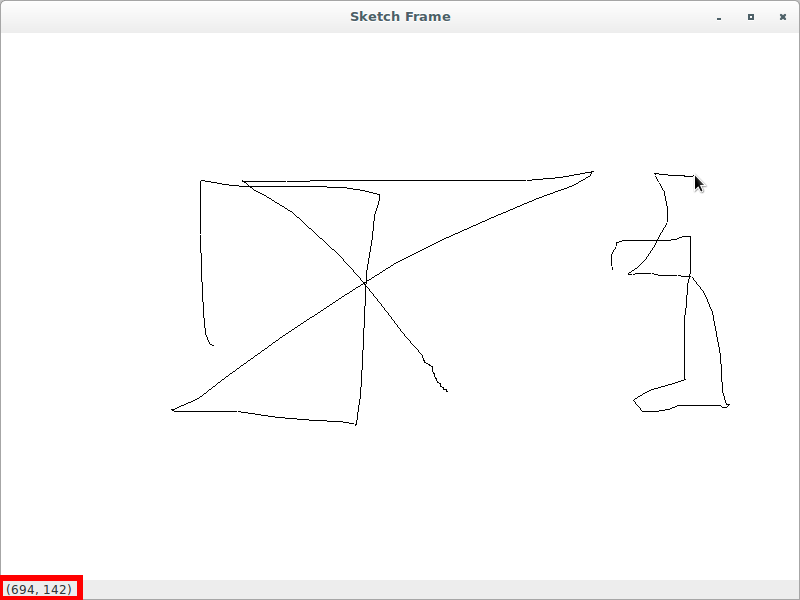

# Development

## Add a basic starting point for the initial version

The application's source code is:

```python
#!/usr/bin/env python3
import wx

class SketchFrame(wx.Frame):
    def __init__(self, parent):
        wx.Frame.__init__(self, 
                          parent, 
                          -1, 
                          "Sketch Frame", 
                          size = (800, 600))

class App(wx.App):
    def OnInit(self):
        self.frame = SketchFrame(None)
        self.frame.Show(True)
        self.SetTopWindow(self.frame)
        return True

def main():
    app = App(False)
    app.MainLoop()


if __name__ == '__main__':
    main()
```


Also, type `$ git checkout 1b` to perform a checkout of this version.

## Add the `SketchWindow` class and modify the `SketchFrame` class

The `SketchWindow` class is added with a minimal initialization 
definition and the `sketch` variable in the `SketchFrame` class is 
created.

The application's source code is:

```python
#!/usr/bin/env python3
import wx

class SketchWindow(wx.Window):
    def __init__(self, parent, id):
        wx.Window.__init__(self, parent, id)
        self.SetBackgroundColour("White")
        self.color = "Black"
        self.thickness = 1
        self.pen = wx.Pen(self.color, self.thickness, wx.SOLID)
        self.lines = []
        self.curLine = []
        self.pos = (0, 0)

class SketchFrame(wx.Frame):
    def __init__(self, parent):
        wx.Frame.__init__(self, 
                          parent, 
                          -1, 
                          "Sketch Frame", 
                          size = (800, 600))
        self.sketch = SketchWindow(self, -1)

class App(wx.App):
    def OnInit(self):
        self.frame = SketchFrame(None)
        self.frame.Show(True)
        self.SetTopWindow(self.frame)
        return True

def main():
    app = App(False)
    app.MainLoop()


if __name__ == '__main__':
    main()
```


Also, type `$ git checkout 1c` to perform a checkout of this version.

## Add the `InitBuffer()` and `DrawLines()` methods to `SketchWindow`

The `InitBuffer()` method is added to the `SketchWindow` initialization 
definition. Also, both `InitBuffer()` and `DrawLines()` methods are 
added to the `SketchWindow` class.

The application's source code is:

```python
#!/usr/bin/env python3
import wx

class SketchWindow(wx.Window):
    def __init__(self, parent, id):
        wx.Window.__init__(self, parent, id)
        self.SetBackgroundColour("White")
        self.color = "Black"
        self.thickness = 1
        self.pen = wx.Pen(self.color, self.thickness, wx.SOLID)
        self.lines = []
        self.curLine = []
        self.pos = (0, 0)
        self.InitBuffer()

    def InitBuffer(self):
        size = self.GetClientSize()
        self.buffer = wx.Bitmap(size.width, size.height)
        dc = wx.BufferedDC(None, self.buffer)
        dc.SetBackground(wx.Brush(self.GetBackgroundColour()))
        dc.Clear()
        self.DrawLines(dc)
        self.reInitBuffer = False

    def DrawLines(self, dc):
        for colour, thickness, line in self.lines:
            pen = wx.Pen(colour, thickness, wx.SOLID)
            dc.SetPen(pen)
            for coords in line:
                dc.DrawLine(*coords)

class SketchFrame(wx.Frame):
    def __init__(self, parent):
        wx.Frame.__init__(self, 
                          parent, 
                          -1, 
                          "Sketch Frame", 
                          size = (800, 600))
        self.sketch = SketchWindow(self, -1)

class App(wx.App):
    def OnInit(self):
        self.frame = SketchFrame(None)
        self.frame.Show(True)
        self.SetTopWindow(self.frame)
        return True

def main():
    app = App(False)
    app.MainLoop()


if __name__ == '__main__':
    main()
```

Also, type `$ git checkout 1d` to perform a checkout of this version.

## Bind `OnLeftDown` and `OnLeftUp` events to `SketchWindow` and add method definitions

The application's source code is:

```python
#!/usr/bin/env python3
import wx

class SketchWindow(wx.Window):
    def __init__(self, parent, id):
        wx.Window.__init__(self, parent, id)
        self.SetBackgroundColour("White")
        self.color = "Black"
        self.thickness = 1
        self.pen = wx.Pen(self.color, self.thickness, wx.SOLID)
        self.lines = []
        self.curLine = []
        self.pos = (0, 0)
        self.InitBuffer()

        self.Bind(wx.EVT_LEFT_DOWN, self.OnLeftDown)
        self.Bind(wx.EVT_LEFT_UP, self.OnLeftUp)

    def InitBuffer(self):
        size = self.GetClientSize()
        self.buffer = wx.Bitmap(size.width, size.height)
        dc = wx.BufferedDC(None, self.buffer)
        dc.SetBackground(wx.Brush(self.GetBackgroundColour()))
        dc.Clear()
        self.DrawLines(dc)
        self.reInitBuffer = False

    def DrawLines(self, dc):
        for colour, thickness, line in self.lines:
            pen = wx.Pen(colour, thickness, wx.SOLID)
            dc.SetPen(pen)
            for coords in line:
                dc.DrawLine(*coords)

    def OnLeftDown(self, event):
        self.curLine = []
        self.pos = event.GetPosition()
        self.CaptureMouse()

    def OnLeftUp(self, event):
        if self.HasCapture():
            self.lines.append((self.color, 
                               self.thickness, 
                               self.curLine))
            self.curLine = []
            self.ReleaseMouse()

class SketchFrame(wx.Frame):
    def __init__(self, parent):
        wx.Frame.__init__(self, 
                          parent, 
                          -1, 
                          "Sketch Frame", 
                          size = (800, 600))
        self.sketch = SketchWindow(self, -1)

class App(wx.App):
    def OnInit(self):
        self.frame = SketchFrame(None)
        self.frame.Show(True)
        self.SetTopWindow(self.frame)
        return True

def main():
    app = App(False)
    app.MainLoop()


if __name__ == '__main__':
    main()
```

Also, type `$ git checkout 1e` to perform a checkout of this version.

## Add a first functional application that draws black lines and resizes sketch

Bind `OnMotion`, `OnSize`, `OnIdle`, and `OnPaint` events 
to `SketchWindow` and add method definitions. Also, add `GetLinesData`
, `SetLinesData`, `drawMotion`, `SetColor` and `SetThickness` method 
definitions.

The application's source code is:

```python
#!/usr/bin/env python3
import wx

class SketchWindow(wx.Window):
    def __init__(self, parent, id):
        wx.Window.__init__(self, parent, id)
        self.SetBackgroundColour("White")
        self.color = "Black"
        self.thickness = 1
        self.pen = wx.Pen(self.color, self.thickness, wx.SOLID)
        self.lines = []
        self.curLine = []
        self.pos = (0, 0)
        self.InitBuffer()

        self.Bind(wx.EVT_LEFT_DOWN, self.OnLeftDown)
        self.Bind(wx.EVT_LEFT_UP, self.OnLeftUp)
        self.Bind(wx.EVT_MOTION, self.OnMotion)
        self.Bind(wx.EVT_SIZE, self.OnSize)
        self.Bind(wx.EVT_IDLE, self.OnIdle)
        self.Bind(wx.EVT_PAINT, self.OnPaint)

    def InitBuffer(self):
        size = self.GetClientSize()
        self.buffer = wx.Bitmap(size.width, size.height)
        dc = wx.BufferedDC(None, self.buffer)
        dc.SetBackground(wx.Brush(self.GetBackgroundColour()))
        dc.Clear()
        self.DrawLines(dc)
        self.reInitBuffer = False

    def GetLinesData(self):
        return self.lines[:]

    def SetLinesData(self, lines):
        self.lines = lines[:]
        self.InitBuffer()
        self.Refresh()

    def DrawLines(self, dc):
        for colour, thickness, line in self.lines:
            pen = wx.Pen(colour, thickness, wx.SOLID)
            dc.SetPen(pen)
            for coords in line:
                dc.DrawLine(*coords)

    def OnLeftDown(self, event):
        self.curLine = []
        self.pos = event.GetPosition()
        self.CaptureMouse()

    def OnLeftUp(self, event):
        if self.HasCapture():
            self.lines.append((self.color, 
                               self.thickness, 
                               self.curLine))
            self.curLine = []
            self.ReleaseMouse()

    def OnMotion(self, event):
        if event.Dragging() and event.LeftIsDown():
            dc = wx.BufferedDC(wx.ClientDC(self), self.buffer)
            self.drawMotion(dc, event)
        event.Skip()

    def drawMotion(self, dc, event):
        dc.SetPen(self.pen)
        newPos = event.GetPosition()
        coords = tuple(self.pos) + tuple(newPos)
        self.curLine.append(coords)
        dc.DrawLine(*coords)
        self.pos = newPos

    def OnSize(self, event):
        self.reInitBuffer = True

    def OnIdle(self, event):
        if self.reInitBuffer:
            self.InitBuffer()
            self.Refresh(False)

    def OnPaint(self, event):
        dc = wx.BufferedPaintDC(self, self.buffer)

    def SetColor(self, color):
        self.color = color
        self.pen = wx.Pen(self.color, self.thickness, wx.SOLID)

    def SetThickness(self, num):
        self.thickness = num
        self.pen = wx.Pen(self.color, self.thickness, wx.SOLID)

class SketchFrame(wx.Frame):
    def __init__(self, parent):
        wx.Frame.__init__(self, 
                          parent, 
                          -1, 
                          "Sketch Frame", 
                          size = (800, 600))
        self.sketch = SketchWindow(self, -1)

class App(wx.App):
    def OnInit(self):
        self.frame = SketchFrame(None)
        self.frame.Show(True)
        self.SetTopWindow(self.frame)
        return True

def main():
    app = App(False)
    app.MainLoop()


if __name__ == '__main__':
    main()
```


Also, type `$ git checkout 2a` to perform a checkout of this version.

## Rename main script so `SketchWindow` is importable

Rewrite main script so it's possible to import `SkecthWindow` class. 
To do that, just rename the old main script to `base.py` using Git:

`$ git mv sketchy.py base.py`

Also, type `$ git checkout 2b` to perform a checkout of this version.

## Use main script with the `base` module

The application's source code is:

```python
#!/usr/bin/env python3
import wx
from base import SketchWindow

class SketchFrame(wx.Frame):
    def __init__(self, parent):
        wx.Frame.__init__(self, 
                          parent, 
                          -1, 
                          "Sketch Frame", 
                          size = (800, 600))
        self.sketch = SketchWindow(self, -1)

class App(wx.App):
    def OnInit(self):
        self.frame = SketchFrame(None)
        self.frame.Show(True)
        self.SetTopWindow(self.frame)
        return True

def main():
    app = App(False)
    app.MainLoop()


if __name__ == '__main__':
    main()
```

Also, type `$ git checkout 2c` to perform a checkout of this version.

## Add, place and update status bar in the bottom of a frame

* Bind the `OnSketchMotion` event handler to the `wx.EVT_MOTION` event 
within the `SkectchFrame` class.
* Create the status bar within the `SkectchFrame` class.
* Add the `OnSketchMotion` method definition to display the current 
mouse pointer position in the status bar.

The application's source code is:

```python
#!/usr/bin/env python3
import wx
from base import SketchWindow

class SketchFrame(wx.Frame):
    def __init__(self, parent):
        wx.Frame.__init__(self, 
                          parent, 
                          -1, 
                          "Sketch Frame", 
                          size = (800, 600))
        self.sketch = SketchWindow(self, -1)
        self.sketch.Bind(wx.EVT_MOTION, self.OnSketchMotion)
        self.statusbar = self.CreateStatusBar()

    def OnSketchMotion(self, event):
        self.statusbar.SetStatusText(str(event.GetPosition()))
        event.Skip()

class App(wx.App):
    def OnInit(self):
        self.frame = SketchFrame(None)
        self.frame.Show(True)
        self.SetTopWindow(self.frame)
        return True

def main():
    app = App(False)
    app.MainLoop()


if __name__ == '__main__':
    main()
```




Also, type `$ git checkout 3a` to perform a checkout of this version.

## Configure status bar to display three text fields

* Create three status text fields in the status bar by calling the 
method `SetFieldsCount(3)`.
* Adjust the sizes of the text fields in the status bar by calling the 
method `SetStatusWidths([-1, -2, -3])`.
* Add support for two more status fields, one which shows the number of 
points in the current line being drawn, the other shows the number of 
lines in the current sketch.

The application's source code is:

```python
#!/usr/bin/env python3
import wx
from base import SketchWindow

class SketchFrame(wx.Frame):
    def __init__(self, parent):
        wx.Frame.__init__(self, 
                          parent, 
                          -1, 
                          "Sketch Frame", 
                          size = (800, 600))
        self.sketch = SketchWindow(self, -1)
        self.sketch.Bind(wx.EVT_MOTION, self.OnSketchMotion)
        self.statusbar = self.CreateStatusBar()
        self.statusbar.SetFieldsCount(3)
        self.statusbar.SetStatusWidths([-1, -2, -3])

    def OnSketchMotion(self, event):
        self.statusbar.SetStatusText("Pos: {}".\
                                     format(str(event.GetPosition())), 
                                     0)
        self.statusbar.SetStatusText("Current Pts: {}".\
                                     format(len(self.sketch.curLine)), 
                                     1)
        self.statusbar.SetStatusText("Line Count: {}".\
                                     format(len(self.sketch.lines)), 
                                     2)
        event.Skip()

class App(wx.App):
    def OnInit(self):
        self.frame = SketchFrame(None)
        self.frame.Show(True)
        self.SetTopWindow(self.frame)
        return True

def main():
    app = App(False)
    app.MainLoop()


if __name__ == '__main__':
    main()
```


Also, type `$ git checkout 3b` to perform a checkout of this version.

## Include a submenu and checked or radio menu item

* Rewrite the way the status bar is created in the `SkectchFrame` 
class by using the `initStatusBar` method (remember refactoring).
* Create the menu bar by calling the method `createMenuBar` and add 
these methods and/or functions: `menuData`, `createMenuBar`
, `createMenu` and `createMenuItem`.
* Add and define event handlers `OnNew`, `OnOpen`, `OnSave`, `OnColor` 
and `OnCloseWindow`.

The application's source code is:

```python
#!/usr/bin/env python3
import wx
from base import SketchWindow

class SketchFrame(wx.Frame):
    def __init__(self, parent):
        wx.Frame.__init__(self, 
                          parent, 
                          -1, 
                          "Sketch Frame", 
                          size = (800, 600))
        self.sketch = SketchWindow(self, -1)
        self.sketch.Bind(wx.EVT_MOTION, self.OnSketchMotion)
        self.initStatusBar()
        self.createMenuBar()

    def initStatusBar(self):
        self.statusbar = self.CreateStatusBar()
        self.statusbar.SetFieldsCount(3)
        self.statusbar.SetStatusWidths([-1, -2, -3])

    def OnSketchMotion(self, event):
        self.statusbar.SetStatusText("Pos: {}".\
                                     format(str(event.GetPosition())), 
                                     0)
        self.statusbar.SetStatusText("Current Pts: {}".\
                                     format(len(self.sketch.curLine)), 
                                     1)
        self.statusbar.SetStatusText("Line Count: {}".\
                                     format(len(self.sketch.lines)), 
                                     2)
        event.Skip()

    def menuData(self):
        return [("&File", (
                          ("&New", "New Sketch file", self.OnNew), 
                          ("&Open", "Open sketch file", self.OnOpen), 
                          ("&Save", "Save sketch file", self.OnSave), 
                          ("", "", ""), 
                          ("&Color", (
                                     ("&Black", 
                                      "", 
                                      self.OnColor, 
                                      wx.ITEM_RADIO), 
                                     ("&Red", 
                                      "", 
                                      self.OnColor, 
                                      wx.ITEM_RADIO), 
                                     ("&Green", 
                                      "", 
                                      self.OnColor, 
                                      wx.ITEM_RADIO), 
                                     ("&Blue", 
                                      "", 
                                      self.OnColor, 
                                      wx.ITEM_RADIO))), 
                          ("", "", ""),
                          ("&Quit", "Quit", self.OnCloseWindow)))]

    def createMenuBar(self):
        menuBar = wx.MenuBar()
        for eachMenuData in self.menuData():
            menuLabel = eachMenuData[0]
            menuItems = eachMenuData[1]
            menuBar.Append(self.createMenu(menuItems), menuLabel)
        self.SetMenuBar(menuBar)

    def createMenu(self, menuData):
        menu = wx.Menu()
        for eachItem in menuData:
            if len(eachItem) == 2:
                label = eachItem[0]
                subMenu = self.createMenu(eachItem[1])
                menu.Append(wx.NewId(), label, subMenu)
            else:
                self.createMenuItem(menu, *eachItem)
        return menu

    def createMenuItem(self, 
                       menu, 
                       label, 
                       status, 
                       handler, 
                       kind = wx.ITEM_NORMAL):
        if not label:
            menu.AppendSeparator()
            return
        menuItem = menu.Append(-1, label, status, kind)
        self.Bind(wx.EVT_MENU, handler, menuItem)

    def OnNew(self, event): pass
    def OnOpen(self, event): pass
    def OnSave(self, event): pass

    def OnColor(self, event):
        menubar = self.GetMenuBar()
        itemId = event.GetId()
        item = menubar.FindItemById(itemId)
        color = item.GetLabel()
        self.sketch.SetColor(color)

    def OnCloseWindow(self, event):
        self.Destroy()

class App(wx.App):
    def OnInit(self):
        self.frame = SketchFrame(None)
        self.frame.Show(True)
        self.SetTopWindow(self.frame)
        return True

def main():
    app = App(False)
    app.MainLoop()


if __name__ == '__main__':
    main()
```


Also, type `$ git checkout 3c` to perform a checkout of this version.

## Include a toolbar

* Create the toolbar by calling the method `createToolBar` and add 
these methods and/or functions: `createToolBar`, `createTool`
, `toolbarData`, `createColorTool`, `MakeBitmap` and `toolbarColorData`.
* Change the `OnColor` method to reflect changes to the toolbar 
selection.
* Make sure toolbar icon files within *files* folder are available.

The application's source code is:

```python
#!/usr/bin/env python3
import wx
from base import SketchWindow

class SketchFrame(wx.Frame):
    def __init__(self, parent):
        wx.Frame.__init__(self, 
                          parent, 
                          -1, 
                          "Sketch Frame", 
                          size = (800, 600))
        self.sketch = SketchWindow(self, -1)
        self.sketch.Bind(wx.EVT_MOTION, self.OnSketchMotion)
        self.initStatusBar()
        self.createMenuBar()
        self.createToolBar()

    def initStatusBar(self):
        self.statusbar = self.CreateStatusBar()
        self.statusbar.SetFieldsCount(3)
        self.statusbar.SetStatusWidths([-1, -2, -3])

    def OnSketchMotion(self, event):
        self.statusbar.SetStatusText("Pos: {}".\
                                     format(str(event.GetPosition())), 
                                     0)
        self.statusbar.SetStatusText("Current Pts: {}".\
                                     format(len(self.sketch.curLine)), 
                                     1)
        self.statusbar.SetStatusText("Line Count: {}".\
                                     format(len(self.sketch.lines)), 
                                     2)
        event.Skip()

    def menuData(self):
        return [("&File", (
                          ("&New", "New Sketch file", self.OnNew), 
                          ("&Open", "Open sketch file", self.OnOpen), 
                          ("&Save", "Save sketch file", self.OnSave), 
                          ("", "", ""), 
                          ("&Color", (
                                     ("&Black", 
                                      "", 
                                      self.OnColor, 
                                      wx.ITEM_RADIO), 
                                     ("&Red", 
                                      "", 
                                      self.OnColor, 
                                      wx.ITEM_RADIO), 
                                     ("&Green", 
                                      "", 
                                      self.OnColor, 
                                      wx.ITEM_RADIO), 
                                     ("&Blue", 
                                      "", 
                                      self.OnColor, 
                                      wx.ITEM_RADIO))), 
                          ("", "", ""),
                          ("&Quit", "Quit", self.OnCloseWindow)))]

    def createMenuBar(self):
        menuBar = wx.MenuBar()
        for eachMenuData in self.menuData():
            menuLabel = eachMenuData[0]
            menuItems = eachMenuData[1]
            menuBar.Append(self.createMenu(menuItems), menuLabel)
        self.SetMenuBar(menuBar)

    def createMenu(self, menuData):
        menu = wx.Menu()
        for eachItem in menuData:
            if len(eachItem) == 2:
                label = eachItem[0]
                subMenu = self.createMenu(eachItem[1])
                menu.Append(wx.NewId(), label, subMenu)
            else:
                self.createMenuItem(menu, *eachItem)
        return menu

    def createMenuItem(self, 
                       menu, 
                       label, 
                       status, 
                       handler, 
                       kind = wx.ITEM_NORMAL):
        if not label:
            menu.AppendSeparator()
            return
        menuItem = menu.Append(-1, label, status, kind)
        self.Bind(wx.EVT_MENU, handler, menuItem)

    def createToolBar(self):
        toolbar = self.CreateToolBar()
        for each in self.toolbarData():
            self.createTool(toolbar, *each)
        toolbar.AddSeparator()
        for each in self.toolbarColorData():
            self.createColorTool(toolbar, each)
        toolbar.Realize()

    def createTool(self, toolbar, label, filename, help, handler):
        if not label:
            toolbar.AddSeparator()
            return
        bitmap = wx.Image(filename, wx.BITMAP_TYPE_BMP).ConvertToBitmap()
        tool = toolbar.AddTool(-1, 
                               label, 
                               bitmap, 
                               wx.NullBitmap, 
                               kind = wx.ITEM_NORMAL, 
                               shortHelpString = help, 
                               longHelpString = "", 
                               clientData = None)
        self.Bind(wx.EVT_MENU, handler, tool)

    def toolbarData(self):
        return (("New", 
                 "files/new.bmp", 
                 "Create new sketch", 
                 self.OnNew),
                ("", "", "", ""), 
                ("Open", 
                 "files/open.bmp", 
                 "Open existing sketch", 
                 self.OnOpen),
                ("Save", 
                 "files/save.bmp", 
                 "Save existing sketch", 
                 self.OnSave))

    def createColorTool(self, toolbar, color):
        bmp = self.MakeBitmap(color)
        tool = toolbar.AddRadioTool(-1, 
                                    label = "", 
                                    bitmap1 = bmp, 
                                    bmpDisabled = wx.NullBitmap, 
                                    shortHelp = color, 
                                    longHelp = "", 
                                    clientData = None)
        self.Bind(wx.EVT_MENU, self.OnColor, tool)

    def MakeBitmap(self, color):
        bmp = wx.Bitmap(16, 15)
        dc = wx.MemoryDC()
        dc.SelectObject(bmp)
        dc.SetBackground(wx.Brush(color))
        dc.Clear()
        dc.SelectObject(wx.NullBitmap)
        return bmp

    def toolbarColorData(self):
        return ("Black", "Red", "Green", "Blue")

    def OnNew(self, event): pass
    def OnOpen(self, event): pass
    def OnSave(self, event): pass

    def OnColor(self, event):
        menubar = self.GetMenuBar()
        itemId = event.GetId()
        item = menubar.FindItemById(itemId)
        if not item:
            toolbar = self.GetToolBar()
            item = toolbar.FindById(itemId)
            color = item.GetShortHelp()
        else:
            color = item.GetLabel()
        self.sketch.SetColor(color)

    def OnCloseWindow(self, event):
        self.Destroy()

class App(wx.App):
    def OnInit(self):
        self.frame = SketchFrame(None)
        self.frame.Show(True)
        self.SetTopWindow(self.frame)
        return True

def main():
    app = App(False)
    app.MainLoop()


if __name__ == '__main__':
    main()
```


Also, type `$ git checkout 3d` to perform a checkout of this version.
